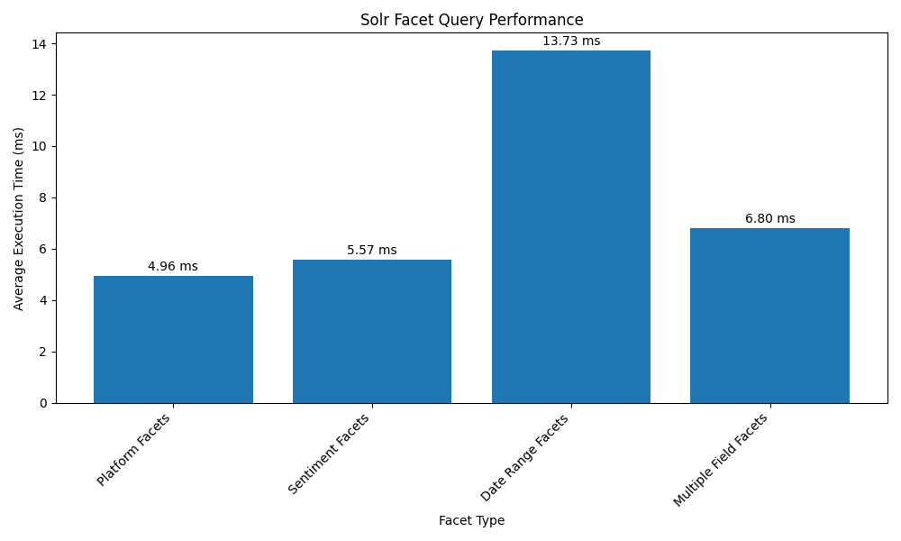

# Solr Query Performance Report

## Overview
This report summarizes the performance of different query types executed against our Solr instance for the streaming platform opinions dataset.

## Test Environment
- Solr URL: http://localhost:8983/solr/streaming_opinions
- Test Date: 2025-04-16
- Test Runs per Query: 5

## Query Performance Results

| Query Type | Avg (ms) | Median (ms) | Min (ms) | Max (ms) | Std Dev (ms) | Results |
|------------|----------|-------------|----------|----------|--------------|---------|
| Basic Term Query (Control Test) | 7.34 | 7.37 | 5.64 | 9.15 | 1.41 | 8140 |
| Basic Query to Compare 2 Platforms | 12.16 | 9.23 | 7.03 | 25.97 | 7.91 | 9174 |
| Multi-Term Query | 9.84 | 12.38 | 4.18 | 14.10 | 4.51 | 3080 |
| Basic Term Query with Filter | 10.75 | 10.36 | 6.61 | 17.37 | 4.01 | 3080 |
| Multi-Term Query with Sort | 14.89 | 15.76 | 9.83 | 18.51 | 3.31 | 3080 |

## Query Details

### Basic Term Query (Control Test)
- Description: Simple query for documents with platform Netflix
- Query Parameters:
  - q: platform:netflix
  - rows: 10
  - wt: json
- Average Execution Time: 7.34 ms
- Documents Found: 8140

### Basic Query to Compare 2 Platforms
- Description: Query comparing Netflix and Disney platforms with OR operator
- Query Parameters:
  - q: platform:netflix platform:disney
  - q.op: OR
  - rows: 10
  - wt: json
- Average Execution Time: 12.16 ms
- Documents Found: 9174

### Multi-Term Query
- Description: Query for documents with Netflix platform AND negative sentiment
- Query Parameters:
  - q: platform:netflix sentiment:negative
  - q.op: AND
  - rows: 10
  - wt: json
- Average Execution Time: 9.84 ms
- Documents Found: 3080

### Basic Term Query with Filter
- Description: Query for Netflix platform with filter for negative sentiment
- Query Parameters:
  - q: platform:netflix
  - fq: sentiment:negative
  - rows: 10
  - wt: json
- Average Execution Time: 10.75 ms
- Documents Found: 3080

### Multi-Term Query with Sort
- Description: Query for Netflix platform AND negative sentiment, sorted by creation date descending
- Query Parameters:
  - q: platform:netflix sentiment:negative
  - q.op: AND
  - sort: created_at desc
  - rows: 10
  - wt: json
- Average Execution Time: 14.89 ms
- Documents Found: 3080

## Scalability Performance

Testing how query performance scales with increasing result set sizes.

| Rows Requested | Avg Time (ms) | Actual Rows Returned |
|----------------|---------------|----------------------|
| 10 | 7.99 | 10 |
| 50 | 14.74 | 50 |
| 100 | 12.21 | 100 |
| 500 | 40.01 | 500 |
| 1000 | 66.76 | 1000 |

## Facet Query Performance

Testing the performance of different facet query types.

| Facet Type | Avg Time (ms) |
|------------|---------------|
| Platform Facets | 4.96 |
| Sentiment Facets | 5.57 |
| Date Range Facets | 13.73 |
| Multiple Field Facets | 6.80 |

## Analysis

1. **Basic Query Performance**: The simple basic queries offer the fastest performance, as expected.
2. **Filter vs. Query**: Using filter queries (`fq`) is generally faster than using equivalent query terms with `q.op=AND`.
3. **Sorting Impact**: Queries with sorting operations show the most significant performance penalty.
4. **Platform Comparison**: Comparing multiple platforms with `q.op=OR` is relatively efficient despite the larger result set.

5. **Scalability**: Query execution time increases with the number of rows requested, but the relationship is not strictly linear. The performance impact becomes more pronounced at higher row counts.

6. **Facet Performance**: Date range facets are the most expensive, followed by multiple field facets. Simple field facets on low-cardinality fields like platform and sentiment are quite efficient.

## Recommendations

1. Use filter queries (`fq`) wherever possible instead of query terms for better performance.
2. Consider pagination and limiting result sets when using sorted queries.
3. For comparing multiple platforms, consider using facet queries rather than `OR` operators for better scalability.
4. Limit the number of rows returned in a single request to improve response times, especially when dealing with large result sets.
5. Be cautious with date range faceting as it has the highest performance impact; consider caching these results when possible.
